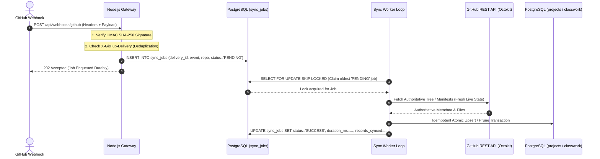

# FINAL IMPLEMENTATION PLAN: GitHub-Driven Portfolio & Academic Classwork System

> **STATUS:** AWAITING USER APPROVAL (PLAN ONLY — NO CODE OR INFRASTRUCTURE MODIFIED)

---

## 1. Executive Summary & Core Architectural Standards

This document establishes the final architectural implementation plan for extending Piyush's portfolio website into an automated, GitHub-driven portfolio and academic classwork system.

### Core Architectural Axioms:
1. **Authoritative Source of Truth**: **GitHub** is the authoritative source of truth.
2. **PostgreSQL Role**: **PostgreSQL** serves as a synchronized relational index and cache for high-speed website delivery. The database can be **deterministically rebuilt from GitHub through a full synchronization** at any time.
3. **Preservation of Design**: 100% fidelity to the existing minimal editorial visual identity (warm ivory canvas, bronze borders, Cormorant Garamond serif headings, Poppins sans-serif interface text, unboxed gold labels, minimal underline/box button styling).
4. **Preservation of Existing Features**: Existing sections and navigation links (including **Resume**) are strictly preserved.

---

## 2. Webhook Architecture & PostgreSQL-Backed Job Durability

To ensure GitHub receives an immediate `2xx` acknowledgement while eliminating the risk of lost in-memory background tasks (e.g., if a server restarts mid-sync), the system employs a **PostgreSQL-backed durable job queue**. No external dependencies (Redis, BullMQ) are required.



### PostgreSQL Job Queue Specification (`sync_jobs` Table)
```sql
CREATE TABLE sync_jobs (
    id SERIAL PRIMARY KEY,
    delivery_id VARCHAR(100) UNIQUE NOT NULL, -- X-GitHub-Delivery header (deduplication)
    event_type VARCHAR(50) NOT NULL,          -- 'push', 'repository', 'manual_full', etc.
    repository_name VARCHAR(150),
    payload_summary JSONB,
    status VARCHAR(20) NOT NULL DEFAULT 'PENDING', -- 'PENDING', 'PROCESSING', 'SUCCESS', 'FAILED'
    attempts INT NOT NULL DEFAULT 0,
    max_attempts INT NOT NULL DEFAULT 3,
    error_message TEXT,
    locked_at TIMESTAMPTZ,
    duration_ms INT,
    created_at TIMESTAMPTZ NOT NULL DEFAULT NOW(),
    updated_at TIMESTAMPTZ NOT NULL DEFAULT NOW()
);

CREATE INDEX idx_sync_jobs_pending ON sync_jobs (status, created_at) WHERE status = 'PENDING';
```

---

## 3. GitHub Event Coverage & Reconciliation Strategy

### Exact Webhook Event & Action Mapping:

| GitHub Event | Relevant Actions | What it Detects | System Sync Action |
| :--- | :--- | :--- | :--- |
| **`push`** | Default push | Commits, file additions, file updates, file deletions, Git renames in `bsc-it-classwork` or project repositories (e.g. updating `portfolio.json`). | Enqueues durable sync job for the affected repository. |
| **`repository`** | `deleted`, `archived`, `privatized` | A showcase project repository is deleted, archived, or made private. | Enqueues removal/soft-delete job for `projects` table. |
| **`repository`** | `edited` | Repository topics, description, or default branch modified in GitHub settings (e.g., adding/removing `portfolio-project` topic). | Enqueues project re-evaluation job (checks topic + `portfolio.json`). |
| **`repository`** | `renamed` | Repository name changed on GitHub. | Enqueues metadata update for repo slug and URLs. |

### Fallback Reconciliation Strategy:
If out-of-band changes occur (e.g., webhook failure or GitHub outage), the system provides two automated fallback mechanisms:
1. **Server Startup Reconciliation**: On application boot, the worker runs a lightweight validation check against GitHub.
2. **Periodic Safety Reconciliation (Cron)**: A lightweight daily cron task runs `POST /api/admin/sync/full` to verify 100% parity between GitHub and PostgreSQL.

---

## 4. Reliable File Viewing & Download Architecture

Because browsers ignore the cross-origin HTML `download` attribute when pointing directly to `raw.githubusercontent.com`, file downloads are routed through a minimal backend streaming proxy endpoint to ensure **100% reliable single-click downloads with exact filenames and content headers**.

```
Frontend Action ──> [ View Link ]     ──> Native Browser Tab / Microsoft Office Online Viewer
Frontend Action ──> [ Download Link ] ──> GET /api/classwork/download/:id
                                                │
                                                ▼
                                   Backend Streams from GitHub API
                                   Sets: Content-Disposition: attachment; filename="Deadlock-Assignment-1.pdf"
                                   Sets: Content-Type: application/pdf
                                                │
                                                ▼
                                   Browser Forces Native Download Dialog
```

### File Format Matrix:

| Format | View Action (`View →`) | Download Action (`Download →`) |
| :--- | :--- | :--- |
| **PDF (`.pdf`)** | Direct link to GitHub Raw URL opened in a new tab (`target="_blank" rel="noopener"`). Native browser PDF rendering. | `/api/classwork/download/:id` (Streams file with `Content-Disposition: attachment`). |
| **PowerPoint (`.pptx`, `.ppt`)** | Microsoft Office Online Web Viewer: `https://view.officeapps.live.com/op/view.aspx?src=<encoded_github_raw_url>`. | `/api/classwork/download/:id` (Forces download of presentation file). |
| **Word (`.docx`, `.doc`)** | Microsoft Office Online Web Viewer or GitHub Blob viewer. | `/api/classwork/download/:id` (Forces download of Word document). |
| **Images (`.png`, `.jpg`)** | Direct link in new tab. | `/api/classwork/download/:id` (Forces image download). |
| **Archives (`.zip`, `.tar`)** | Direct download stream. | `/api/classwork/download/:id` (Forces archive download). |

---

## 5. Final Repository & Metadata Standards

### A. Project Repository (`portfolio.json`)
Eligibility rule: Repository must have the `portfolio-project` topic **and** a valid root `portfolio.json`.

```json
{
  "$schema": "https://json-schema.org/draft/2020-12/schema",
  "schemaVersion": 1,
  "title": "Algorithm Visualizer",
  "shortDescription": "Interactive visualizer for graph traversal and sorting algorithms in Python.",
  "category": "Python & Algorithms",
  "technologies": ["Python", "Pygame", "Algorithms"],
  "featured": true,
  "displayOrder": 1,
  "liveDemoUrl": "https://demo.example.com",
  "thumbnail": "thumbnail.png",
  "status": "Completed",
  "completedDate": "2026-05-15"
}
```

### B. Classwork Repository Structure (`bsc-it-classwork`)
Primary folder taxonomy with optional top-level `metadata.json` for subject display names and codes:

```
bsc-it-classwork/
├── semester-4/
│   ├── operating-system/
│   │   ├── assignments/
│   │   │   └── deadlock-bankers-algorithm.pdf
│   │   ├── presentations/
│   │   │   └── cpu-scheduling-seminar.pptx
│   │   └── notes/
│   │       └── memory-management-unit-2.pdf
│   └── java-programming/
│       └── assignments/
└── metadata.json (Optional display overrides)
```

---

## 6. Final Relational Database Schema (PostgreSQL)

```sql
-- 1. Projects Table
CREATE TABLE projects (
    id SERIAL PRIMARY KEY,
    github_repo_id BIGINT UNIQUE NOT NULL,
    repo_name VARCHAR(100) NOT NULL,
    full_name VARCHAR(150) NOT NULL,
    schema_version INT NOT NULL DEFAULT 1,
    title VARCHAR(120) NOT NULL,
    short_description VARCHAR(300) NOT NULL,
    category VARCHAR(60) NOT NULL,
    technologies TEXT[] NOT NULL DEFAULT '{}',
    github_url VARCHAR(255) NOT NULL,
    live_demo_url VARCHAR(255),
    thumbnail_url VARCHAR(255),
    status VARCHAR(30) NOT NULL DEFAULT 'Completed',
    featured BOOLEAN NOT NULL DEFAULT false,
    display_order INT NOT NULL DEFAULT 100,
    is_visible BOOLEAN NOT NULL DEFAULT true,
    stars_count INT NOT NULL DEFAULT 0,
    forks_count INT NOT NULL DEFAULT 0,
    last_pushed_at TIMESTAMPTZ,
    synced_at TIMESTAMPTZ NOT NULL DEFAULT NOW(),
    created_at TIMESTAMPTZ NOT NULL DEFAULT NOW()
);

CREATE INDEX idx_projects_visible_order ON projects (is_visible, display_order);

-- 2. Academic Semesters Table
CREATE TABLE academic_semesters (
    id SERIAL PRIMARY KEY,
    slug VARCHAR(50) UNIQUE NOT NULL,
    display_name VARCHAR(50) NOT NULL,
    semester_number INT NOT NULL,
    display_order INT NOT NULL DEFAULT 1,
    is_visible BOOLEAN NOT NULL DEFAULT true
);

-- 3. Academic Subjects Table
CREATE TABLE academic_subjects (
    id SERIAL PRIMARY KEY,
    semester_id INT NOT NULL REFERENCES academic_semesters(id) ON DELETE CASCADE,
    slug VARCHAR(80) NOT NULL,
    display_name VARCHAR(120) NOT NULL,
    subject_code VARCHAR(30),
    display_order INT NOT NULL DEFAULT 1,
    is_visible BOOLEAN NOT NULL DEFAULT true,
    UNIQUE(semester_id, slug)
);

-- 4. Classwork Materials Table
CREATE TABLE classwork_materials (
    id SERIAL PRIMARY KEY,
    github_repo_id BIGINT NOT NULL,
    subject_id INT NOT NULL REFERENCES academic_subjects(id) ON DELETE CASCADE,
    file_path VARCHAR(500) NOT NULL,
    file_sha VARCHAR(64) NOT NULL,
    title VARCHAR(150) NOT NULL,
    material_type VARCHAR(50) NOT NULL,
    file_name VARCHAR(200) NOT NULL,
    file_extension VARCHAR(20) NOT NULL,
    github_blob_url VARCHAR(500) NOT NULL,
    github_raw_url VARCHAR(500) NOT NULL,
    is_visible BOOLEAN NOT NULL DEFAULT true,
    display_order INT NOT NULL DEFAULT 100,
    synced_at TIMESTAMPTZ NOT NULL DEFAULT NOW(),
    UNIQUE(github_repo_id, file_path)
);

CREATE INDEX idx_classwork_subject_type ON classwork_materials (subject_id, material_type, is_visible);

-- 5. Durable Sync Jobs Table (Durable Queue + Audit History)
CREATE TABLE sync_jobs (
    id SERIAL PRIMARY KEY,
    delivery_id VARCHAR(100) UNIQUE NOT NULL,
    event_type VARCHAR(50) NOT NULL,
    repository_name VARCHAR(150),
    payload_summary JSONB,
    status VARCHAR(20) NOT NULL DEFAULT 'PENDING',
    attempts INT NOT NULL DEFAULT 0,
    max_attempts INT NOT NULL DEFAULT 3,
    error_message TEXT,
    duration_ms INT,
    created_at TIMESTAMPTZ NOT NULL DEFAULT NOW(),
    updated_at TIMESTAMPTZ NOT NULL DEFAULT NOW()
);

CREATE INDEX idx_sync_jobs_status ON sync_jobs (status, created_at);
```

---

## 7. Frontend Integration & Preserved Navigation

### Full Navigation Specification (Preserving Resume):
The navigation menu across all pages ([index.html](file:///c:/Users/piyus/OneDrive/Desktop/github/HTML&CSS/new-portfolio/index.html), [about.html](file:///c:/Users/piyus/OneDrive/Desktop/github/HTML&CSS/new-portfolio/about.html), `projects.html`, `classwork.html`) will be:

```html
<nav>
    <div class="logo-div">
        <a href="index.html" class="logo-link">Portfolio</a>
    </div>
    <div class="menu-div">
        <ul class="menu-list">
            <li class="menu-list-item"><a href="index.html" class="menu-links">HOME</a></li>
            <li class="menu-list-item"><a href="about.html" class="menu-links">ABOUT</a></li>
            <li class="menu-list-item"><a href="projects.html" class="menu-links">PROJECTS</a></li>
            <li class="menu-list-item"><a href="classwork.html" class="menu-links">CLASSWORK</a></li>
            <li class="menu-list-item"><a href="resume.html" class="menu-links">RESUME</a></li>
        </ul>
    </div>
</nav>
```
*(Resume is fully preserved in the navigation structure across the entire portfolio).*

---

## 8. Frontend UI States & Visual Language

All dynamic views (`projects.html` and `classwork.html`) strictly inherit the warm ivory/bronze design language:

```
┌────────────────────────────────────────────────────────┐
│  [STUDENT OF B.SC (IT)]                                │
│  featured Projects                                     │
│  Selected software engineering & academic projects.    │
├────────────────────────────────────────────────────────┤
│  ┌───────────────────────────┐ ┌────────────────────┐ │
│  │ PYTHON & ALGORITHMS       │ │ FULL STACK WEB     │ │
│  │ Algorithm Visualizer      │ │ Portfolio Platform │ │
│  │ Interactive Pygame graph  │ │ Node.js + Postgre- │ │
│  │ traversal simulator.      │ │ SQL driven archive │ │
│  │ [Python] [Pygame]         │ │ [Node.js] [Postgres│ │
│  │ Code →   Live Demo →      │ │ Code →   Live Demo→│ │
│  └───────────────────────────┘ └────────────────────┘ │
└────────────────────────────────────────────────────────┘
```

### Loading, Empty, and Error States:
1. **Loading State**: Subtle pulsing skeleton cards (`background: var(--warm-100); border: 1px solid rgba(139, 115, 85, 0.2); animation: pulse 1.5s infinite;`).
2. **Empty State**: Unboxed gold label (`STATUS`), Cormorant Garamond title (`No items found`), and muted Poppins description.
3. **Error State**: Minimal bordered box with explanation and direct `View on GitHub →` fallback button.

---

## 9. Final Phased Implementation Roadmap

```
[ Phase 1: Shared UI Tokens & Component CSS (style.css) ]
                      │
                      ▼
[ Phase 2: PostgreSQL Schema Initialization on Neon ]
                      │
                      ▼
[ Phase 3: Node.js Backend & Octokit GitHub Client ]
                      │
                      ▼
[ Phase 4: Durable PostgreSQL Sync Queue & Worker Engine ]
                      │
                      ▼
[ Phase 5: Webhook Handler with HMAC-SHA256 & Deduplication ]
                      │
                      ▼
[ Phase 6: Public REST API & Streaming Download Endpoint ]
                      │
                      ▼
[ Phase 7: Projects Page (projects.html + Dynamic Renderer) ]
                      │
                      ▼
[ Phase 8: Classwork Page (classwork.html + Filter Engine) ]
                      │
                      ▼
[ Phase 9: End-to-End QA, Mobile Audit & Production Deployment ]
```

---

## 10. File-Level Change Plan

### New Files to Create:
- `backend/`
  - `src/config/database.js` *(Neon PostgreSQL pool)*
  - `src/config/env.js` *(Validated environment constants)*
  - `src/services/githubService.js` *(Octokit integration)*
  - `src/services/projectSyncEngine.js` *(Strict manifest validation & upsert)*
  - `src/services/classworkSyncEngine.js` *(Git tree scanner & material parser)*
  - `src/services/syncQueueWorker.js` *(Durable PostgreSQL job processor)*
  - `src/middleware/verifyWebhook.js` *(HMAC SHA-256 verification)*
  - `src/middleware/adminAuth.js` *(X-Admin-Key authorization)*
  - `src/controllers/apiController.js` *(Cached public endpoints + download proxy)*
  - `src/controllers/webhookController.js` *(Enqueues durable sync job)*
  - `src/app.js` & `server.js`
- `projects.html` *(Projects catalog view matching master screenshot)*
- `classwork.html` *(Academic archive view with semester filters)*
- `js/api.js` *(Lightweight public API fetcher with error fallbacks)*
- `js/projects.js` *(Project card renderer)*
- `js/classwork.js` *(Classwork document renderer & filter engine)*

### Existing Files to Modify (Minimal & Safe):
- [index.html](file:///c:/Users/piyus/OneDrive/Desktop/github/HTML&CSS/new-portfolio/index.html) *(Add `PROJECTS` and `CLASSWORK` links to nav, preserving `RESUME`)*
- [about.html](file:///c:/Users/piyus/OneDrive/Desktop/github/HTML&CSS/new-portfolio/about.html) *(Add `PROJECTS` and `CLASSWORK` links to nav, preserving `RESUME`)*
- [style.css](file:///c:/Users/piyus/OneDrive/Desktop/github/HTML&CSS/new-portfolio/style.css) *(Append `.project-card`, `.classwork-card`, `.filter-btn`, and loading skeleton classes)*

---

## 11. Decisions Requiring Final Confirmation From Piyush

1. **Production Hosting**: Confirm approval of **Neon** (PostgreSQL) and **Render** (Node.js API service).
2. **Academic Repository**: Confirm that the classwork repository on GitHub will be named `bsc-it-classwork` under account `Piyush9981`.
3. **Start Approval**: Confirm explicit approval to start **Phase 1 (Shared Component Styles in style.css)**.
